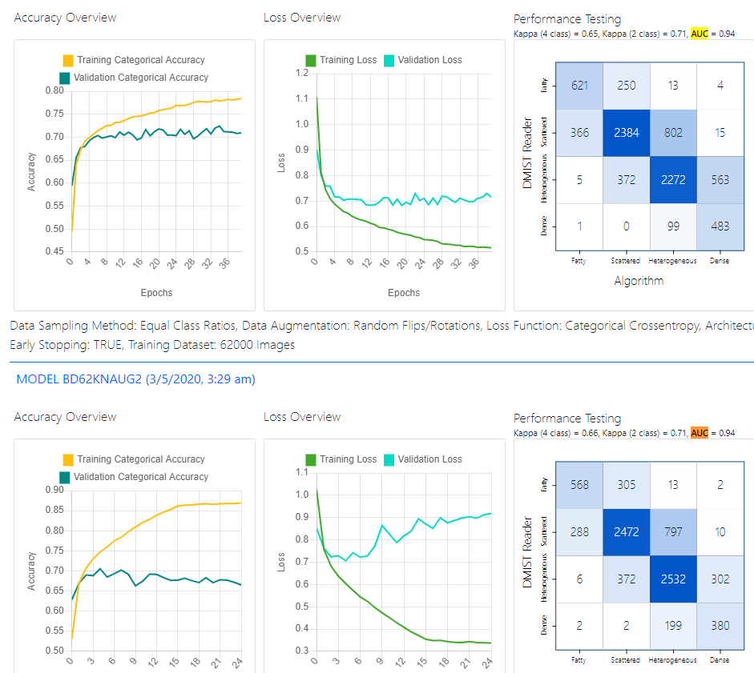

# Adam Corbin - CAP 6635 - AI - Hands on #1 Spring 2020

# Q1 -Trial and error?

True
# Q2 - Overfitting
Overfitting is the term used when a model has been trained so much on a specific data set that when you throw something new at this model it can get confused and has a difficult time giving the correct result
# Q3 - Cost Function

A cost function is a way to evaluate the model on how it performs to the actual real results. In many cases its good to use multiple cost functions just to ensure on a few different approaches might evaluate the model.

# Q4 - Epoch

An Epoch is term used to specify how much if the data set has gone through the model. For example 1 Epoch is equal to all the data in the data set has gone through the model 1 time. 50 epochs would be the data has gone through the model 50 times. Based on the video it sounds like typically they see between 50-100 epochs on a model

# Q5 - Confusion Matrix

The confusion matrix is another way to assess the performance of an algorithm, but not exactly the accuracy of an algorithm. Its possible that you might have a few cases for a class where it was accurate but overall didnt perform well

# Q6 - Tasks for Pre-processing

In the pre-processing stage many frameworks are looking for same size pictures, resolution, format, or color format such as 10-bit. We call this normalization of the images to make sure they are in the same bounds so the algorithms can process the images.

# Q7 - Data Augmentation

Data augmentation was a new term that I have not heard before and it was like a light bulb that went off when I heard it. Its a way take an image and do some image manipulation such as stretch it, flip it, invert it, to give different ways to look at the same data. It sounded like this is a great way to make your model more robust which makes complete sense to be as if all the images were exactly the same orientation I could see overfitting occurring easily. 

# Q8 - Kappa score

This is another way to say how well a model is performing. The ranges are between -1 and 1 where 0 means its random chance to getting the right solution. If we have a .7 to .9 that means the model is performing well on its task at the level to almost a human.

# Q9 - Equal Sampling

The equal sampling is a way to ensure that the train data set has equal amount of all classes represented. In real life if we tool a real distribution between the different classes it could be a low amount of data associated to the bad class. Now if we trained the model with this data set we would do really well with the normal class but the bad classes would do poorly in identification. So with equal sampling we make sure that there is around the same number of samples for each class. 
# Q10 - Overfitting?

Yes this is starting to overfit. If we take a look a Loss Overview as you can see around 6 Epochs we are starting to have the validation loss start to go up which is not what we are looking for. A good point to stop training would be around the 6-8 Epochs for the model

# Q11 - Misclassification

If we look at the confusion matrix we would want to look at the boxes that are not on the left to right, top to bottom diagonal as these are the correct identification. So out side of those 4 boxes we want to look at the top 2 boxes that have the highest score. That would be the 797 box and 372 box. The algorithm top misclassification with 797 would be Heterogeneous class where it was really Scattered class. The 2nd top misclassification with 372 was the algorithm identified Scattered where it should have been Heterogenous. 

# Q12 - AUC

It appears that they both have the same AUC value of .94

# Q13 - Overfitting

Looking at the image below you can see top graph is the 2nd model and the bottom is the first model. You can see that both models the confusion matrices appears to be similar. When looking at Accuracy Overview graph both models have about the same validation accuracy but the training Accuracy for the top model peaks out at .78 where as the bottom peaks out at .87. Also looking at the loss overview the top model out performs in both the validation loss peaking at .7 vs .9 on the bottom and training loss peaks out at .5 where as bottom peaks at .3. This alludes that the bottom model is showing signs of overfitting. This makes sense since the top model added the variation of flipped and modified images to help battle overfitting.

# Q14 - AUC for 3 models
The third model proved to have a AUC of .89. From the reference below it appears that this is still a good AUC score but its not as good as the previous 2 models
Reference to what AUC is : http://gim.unmc.edu/dxtests/roc3.htm
# Q15 - Why are results different?
The different model configuration that we selected meant we didn't have a previous model trained before. This trained model wasn't exactly for this kind of data but a different set, but we were leveraging its structure to see if it adapts well to this application. That has proven to be extremely useful from an accuracy standpoint .

# Q16 - Testing other models & Transfer learning
After testing all the other combinations I found the the origional first model to be the optimial model. What as interesting is the Accuracy overview graphs didnt show up. I am not sure if its a glitch or that was intended.

## Transfer learning
I touched up on this on Q15, but the idea behind transfer learning is taking a model that might have been trained on cat or dogs and try to apply it do a different domain such as radiology. This has surprisingly proven to be pretty successful and as you can see when we compare the models that use random sampling vs using pre-trained weights the pre-trained graphs are much smoother and have better overall results. 

# Q17
## Company 3 & 4 at Site B

## Company 3 & 4 at Site D

## Evaluation of Q17
Looking at the results for company 3 & 4 across Site B and Site D data we can tell that Company 4 has a pretty good track record and preforming well on both data sets. Now Company 3 struggles on both data sets and the confusion matrices is actually pretty different between sites.
### Step 37 
I would love to evaluate my models but for some reason I cant select them when picking Site A-D data sets and I cant select "My site". Weird

# step 45

# Summary
Overall this was a great into hands on assignment to get a feel for the process of how to take real data, build and test a model relatively quickly. I found it fascinating to see that we could build a model that would be valuable today in the medical industry. It was a good learning to understand how we could use a model for training cats and apply it to other domains and it would actually perform quite well versus a random selection of images to train the model. 